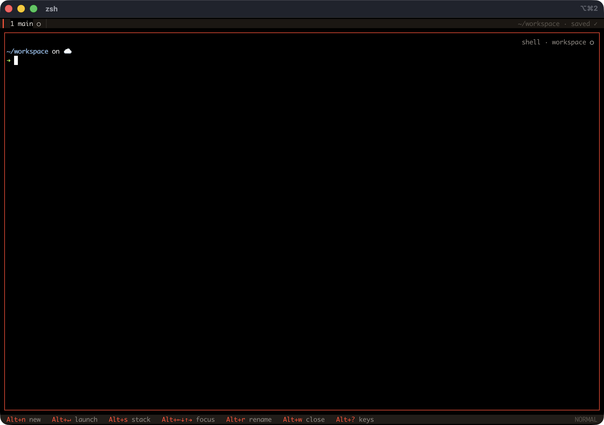

<div align="center">

# roost

**Processes are disposable. Sessions are precious.**

A session-native terminal multiplexer for AI agent CLIs (pi, Claude Code, shell) — no daemon, ever.

[](LICENSE)
[](Cargo.toml)
[](Cargo.toml)




</div>

## Why roost

- **Workspace resurrection.** Quit roost, reboot the Mac, run `roost` again — every tab, split, and stacked pane comes back, each agent resumed into its exact session.
- **Session-native, not process-native.** Agent CLIs persist their own conversation state and resume by id, so roost never needs a daemon — it just remembers the layout tree plus each pane's `(adapter, cwd, session-id)`.
- **Fleet at a glance.** The tab bar, corner badges, and collapsed stack rows show every agent's state — working, needs input, waiting, idle, exited — and roost rings the bell the moment one needs you.
- **A control CLI for orchestrators.** `roost spawn / send / read / status / wait / close` — an LLM (or you) can drive a fleet of agent panes and watch the whole thing live.
- **~1.2 MB, no daemon.** One binary, zero config, nothing to keep alive in the background.

Full design rationale: [DESIGN.md](DESIGN.md).

## Quick start

Needs a Rust toolchain — grab one at [rustup.rs](https://rustup.rs) if you don't have one.

```sh
git clone https://github.com/navbytes/roost
cd roost
cargo build --release
./target/release/roost
```

Or install it onto your `$PATH` with `cargo install --path .` (then just run `roost`), or skip the build step with `cargo run`.

Only one roost runs per workspace at a time — a second instance on the same
state dir refuses to start (they'd race and corrupt `workspace.json`). Run an
isolated one with `ROOST_STATE=/some/dir roost`.

State lives in `~/.local/state/roost/workspace.json` (auto-saved on every
change, atomic writes). Delete it to start clean.

### macOS: make Option send Alt

roost's shortcuts all live on `Alt`. On macOS, **Option** sends accented
characters by default, so shortcuts silently do nothing until you tell your
terminal to treat Option as Meta/Alt:

- **Terminal.app**: Settings → Profiles → Keyboard → check *Use Option as Meta key*.
- **iTerm2**: Settings → Profiles → Keys → set the Left/Right Option key to *Esc+*.
- **Ghostty / WezTerm / kitty**: send Alt by default — nothing to change.

If your first `Alt+n` seems to do nothing, this is almost certainly why. Once
it's set, `Alt+Enter` opens the quick-launch picker (pi / claude / shell) and
you're in.

## Keys

| Key | Action |
|---|---|
| `Alt+n` | new shell pane (auto split direction) |
| `Alt+Enter` | quick-launch picker: pi / claude / shell |
| `Alt+arrow` / `Alt+hjkl` | move focus (expands stacked panes) |
| `Alt+Shift+arrow` | resize along that axis |
| `Alt+s` | toggle: collapse the surrounding split into a stack / explode it |
| `Alt+o` | flip the focused split's orientation (vertical ⇄ horizontal) |
| `Alt+r` | rename pane |
| `Alt+Shift+r` | rename tab (e.g. one tab per project) |
| `Alt+PgUp` | scroll mode (`↑/↓/PgUp/PgDn` scroll, `Esc`/`q` exit) |
| `Alt+c` | copy mode — drag to select text, copies on release (`Esc` cancels) |
| `Alt+t`, `Alt+1..9` | new tab / go to tab |
| `Alt+w` | close pane (press twice to confirm when the agent is busy or it's the last pane) |
| `Alt+u` | undo — reopen the last closed pane/tab, resuming its session |
| `Alt+?` | show the full keymap (any key closes it) |
| `Alt+/` | toggle the shortcut hint bar |
| `Alt+q` | quit — workspace saved; agents die, sessions live |

A shortcut hint bar runs along the bottom by default (zellij-style), showing
the keys you can press right now — it changes with context, so rename /
picker / scroll / dead-pane modes each show their own keys. `Alt+/` hides it
to reclaim the row.

Everything else passes straight through to the focused pane. **Shift+Enter**
and **Ctrl+Enter** are sent as "insert newline" rather than "submit", so you
can compose multi-line prompts in agent TUIs that support it — this needs a
terminal that reports modified keys via the CSI-u ("kitty") keyboard
protocol (**iTerm2, Ghostty, kitty, WezTerm**), which roost negotiates on
start.

> ⚠️ **Not macOS Terminal.app.** It sends Shift+Enter and Option+Enter as the
> same bytes (`ESC CR`), which roost can only read as Alt+Enter — so on
> Terminal.app, Shift+Enter opens the quick-launch picker instead of
> inserting a newline. Use one of the CSI-u terminals above to compose
> multi-line prompts.

In a **dead pane** (process exited or spawn failed): `Enter` relaunches or
resumes, `f` starts fresh (drops the stored session id).

<details>
<summary><strong>Mouse, links & copy mode</strong></summary>

**Mouse**: the wheel scrolls the pane under the cursor — forwarded to the
inner app when it has mouse reporting enabled (pi/claude TUIs, vim, less),
otherwise it scrolls roost's own scrollback for that pane; typing snaps back
to the live tail. A left click focuses a pane (and expands collapsed stack
members). Over a mouse-aware app, clicks and drags are forwarded too, so you
can interact with an agent's TUI directly (menus, buttons, selection). Click
a tab in the tab bar to switch to it.

**Opening links**: `Alt`+click a URL in any pane to open it in your browser
(`open` on macOS, `xdg-open` on Linux). roost uses `Alt`+click rather than a
plain click so it doesn't fight click-to-focus, and because a terminal can't
report Cmd-clicks to it.

**Selecting text**: because roost holds mouse capture (to route the wheel and
clicks), your terminal's own drag-to-select is intercepted. Use **copy mode**
instead: press `Alt+c`, drag to select within a pane, and it copies to your
system clipboard on release (via a native helper — pbcopy / wl-copy / xclip —
and OSC 52, so it works locally and over SSH). This is pane-scoped, unlike the
terminal's native whole-window selection. (Your terminal's Shift+drag native
selection still works too, if you prefer it.)

</details>

## Status glyphs

Tab bar, corner badges, and collapsed stack rows all show the same states:

| Glyph | Meaning |
|---|---|
| `●` | working — pulses |
| `◆` | needs input |
| `○` | waiting for you |
| `·` | idle |
| `✕` | exited |

Status lives in the glyph, not the border — the focused pane's border is
always accent-red, everything else stays quiet. When a non-focused pane
starts waiting for you, roost rings the terminal bell (and posts a native
notification on macOS).

Status arrives two ways:

1. **Exact** — agent-side integrations report over roost's unix socket
   (`$ROOST_SOCK`, pane identified by `$ROOST_PANE`, authenticated with a
   per-pane `$ROOST_TOKEN`):
   - pi: [`extensions/roost.ts`](extensions/roost.ts) — roost installs/updates
     it into `~/.pi/agent/extensions/` automatically at startup when pi is
     present (set `ROOST_NO_EXT_INSTALL` to manage it yourself). Uses pi's
     `agent_start`/`agent_end`/`session_start`/ask-tool events, and reports
     session ids instantly.
   - Claude Code: hook snippets in
     [`extensions/claude-code-hooks.md`](extensions/claude-code-hooks.md).
2. **Heuristic fallback** — recent PTY output ⇒ working; silence ⇒ waiting; a
   terminal bell (`0x07`) ⇒ needs-you (tmux-style). The bell also supplements
   the pi extension for pi's built-in permission prompts, which pi exposes no
   event for.

Each pane also carries a faint **corner badge**, top-right (iTerm2-style):
`name · adapter glyph` — the name is its `Alt+r` title, or the adapter name
(`pi` / `claude` / `shell`) when unnamed, and the glyph is the pane's live
status. A cell TUI can't do true translucency, so it's rendered dim rather
than see-through; the inner app's content still draws underneath it.

## Appearance

> Chrome is ink · paper · one red; program output keeps its own colors.

roost's own chrome — tabs, borders, badges, hint bar — uses three warm grays
for hierarchy and one accent (`#ff563c`) for focus, badges, and live keys.
Program output inside panes keeps its own colors and attributes untouched.
Colors are truecolor RGB: best on a truecolor terminal (iTerm2, Ghostty,
kitty, WezTerm) with a dark background in the `#15120f` family — roost never
repaints your terminal's background. On non-truecolor terminals (macOS
Terminal.app) the palette quantizes; legibility survives, exact hues don't.
Full design spec: [`DESIGN-ui.md`](DESIGN-ui.md).

## Session resume

| Adapter | Launch | Resume | Session detection |
|---|---|---|---|
| `pi` | `pi` | `pi --session <id>` | socket handshake, or newest file under `~/.pi/agent/sessions/` |
| `claude` | `claude` | `claude --resume <id>` | newest `*.jsonl` under `~/.claude/projects/<encoded-cwd>/` |
| `shell` | `$SHELL` | relaunch in saved cwd | — |

New adapters implement the `AgentAdapter` trait in `src/agents/` (eight
methods, most with defaults).

## Controlling roost (CLI / LLM)

A running roost can be driven programmatically over its control socket — the
same binary in client mode:

```sh
roost list                                   # panes: id, adapter, cwd, status, …
roost spawn pi --cwd ~/api --input "run the tests, report pass/fail"
roost read 5 --tail 20                        # a pane's recent output
roost send 5 hello world --enter              # type into a pane (+ Enter)
roost status 5                                # working | waiting | needs_input | …
roost wait 5 --until waiting --timeout 300    # block until the agent finishes
roost fork 5                                  # a sibling in the same context
roost close 5 [--force]
```

(`roost --help` prints this same reference.)

`wait` is what turns "spawn then poll" into "spawn → await → read": block until a
pane hits a status (or a timeout), so an orchestrator doesn't sleep-and-grep.

This is how an LLM manages a fleet — an agent inside a pane can spawn and drive
worker panes for its sub-agents, and you watch (and take over) the whole fleet
live. See [DESIGN-control.md](DESIGN-control.md).

**Authorization is scoped by default, not sandboxed.** A pane acting via its own
`$ROOST_TOKEN` authenticates *as that pane*: its `spawn`/`fork` calls are scoped
to the subtree it creates, and its actions are audited under that pane's id.
That's convenience and defense-in-depth, **not a hard security boundary** — pi
and Claude Code both ship a shell/exec tool, so any in-pane agent can `cat` the
fleet token at `<state>/control.token` (0600, never placed in a pane's env, but
readable by anything running as you) and drive the whole fleet with full reach.
Treat every in-pane agent as capable of full control-plane access. The boundary
roost does enforce is **cross-UID**: the socket and `control.token` are 0600
inside an owner-verified 0700 state dir, so no *other* user on the machine can
drive your roost. Targeting is daemonless: an in-pane client finds its instance
via `$ROOST_SOCK` automatically. Every control action is recorded in
`<state>/control.log` (principal, verb, target, outcome — never the message
text).

<details>
<summary><strong>Architecture</strong> (ports & adapters)</summary>

The core never touches a PTY, socket, or the filesystem — it talks to traits
in `src/ports.rs`, and every core behavior is unit-tested against in-memory
fakes. Real I/O lives at the edges:

```
src/
  core/        the domain — pure, fully unit-tested
    layout.rs    split/stack/pane tree, ops, geometry
    workspace.rs tabs + (adapter, cwd, session-id) per pane
    status.rs    Working/NeedsInput/Waiting/Idle/Exited model
    app.rs       orchestration: App<B: PaneBackend>, actions, modes
    event.rs     event vocabulary (PTY output, exit, socket events)
  ports.rs     trait boundaries: PaneBackend, StateStore, Notifier
               (+ fakes for tests: FakePane, MemStore, RecordingNotifier)
  agents/      domain adapters per CLI: pi, claude, shell (AgentAdapter)
  infra/       production port implementations — all real I/O
    pty.rs       PaneBackend via portable-pty + vt100
    store.rs     StateStore via atomic workspace.json writes
    sock.rs      status socket listener (ndjson over unix socket)
    notify.rs    Notifier via terminal bell / macOS osascript
  ui/          presentation
    render.rs    ratatui drawing (generic over PaneBackend)
    input.rs     key → Action/bytes translation (pure)
    mouse.rs     hit-testing + wheel routing decisions (pure)
  main.rs      composition root: wires infra into core, runs the loop
vendor/vt100/  vendored vt100 with a scrollback-underflow fix (see below)
```

`vendor/vt100`: upstream vt100 0.15.2 panics (`rows_len - scrollback_offset`
underflow) when scrolled back further than one screen height; the vendored
copy fixes `visible_rows()` with a saturating subtraction, which also makes
deep-history scrolling render correctly.

</details>

## Roadmap status

M0 render core ✓ · M1 splits/tabs ✓ · M2 persistence + session detection ✓ ·
M3 status socket + badges ✓ · M4 stacks + resize ✓ · M5 picker, rename,
scroll, notifications ✓. Deferred: floating panes, mouse support, opencode
adapter, config file (roost is deliberately zero-config for now). Full
detail: [ROADMAP.md](ROADMAP.md).

---

<p align="center">
<a href="DESIGN-ui.md">DESIGN-ui.md</a> (design spec) ·
<a href="https://navbytes.github.io/roost/tui-design.html">tui-design.html</a> (design reference) ·
<a href="ROADMAP.md">ROADMAP.md</a> ·
<a href="LICENSE">LICENSE</a>
</p>
