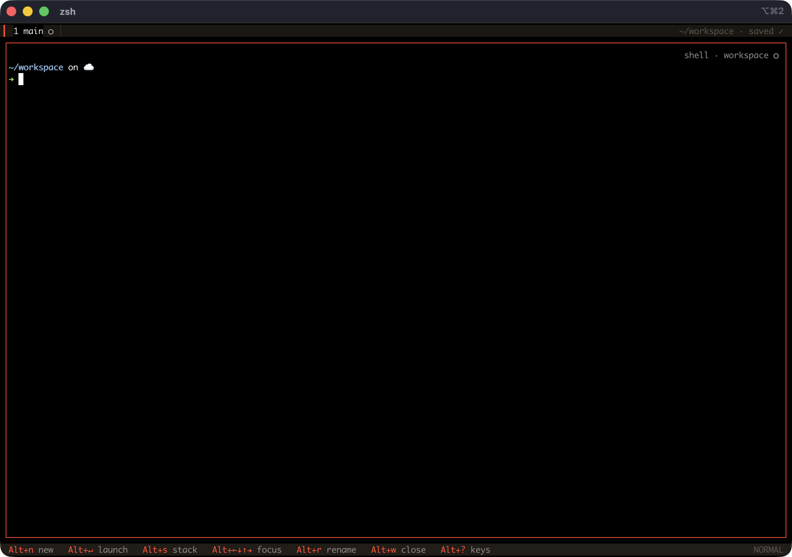

<div align="center">

# roost

**Processes are disposable. Sessions are precious.**

A session-native terminal multiplexer for AI agent CLIs (pi, Claude Code, shell) — no daemon, ever.

[](LICENSE)
[](Cargo.toml)
[](Cargo.toml)




</div>

## Why roost

- **Workspace resurrection.** Quit roost, reboot the Mac, run `roost` again — every tab, split, and stacked pane comes back, each agent resumed into its exact session.
- **Session-native, not process-native.** Agent CLIs persist their own conversation state and resume by id, so roost never needs a daemon — it just remembers the layout tree plus each pane's `(adapter, cwd, session-id)`.
- **Fleet at a glance.** The tab bar, corner badges, and collapsed stack rows show every agent's state — working, needs input, waiting, idle, exited — and roost rings the bell the moment one needs you.
- **A control CLI for orchestrators.** `roost spawn / send / read / status / wait / close` — an LLM (or you) can drive a fleet of agent panes and watch the whole thing live.
- **~1.4 MB, no daemon.** One binary, zero config, nothing to keep alive in the background.

Full design rationale: [DESIGN.md](DESIGN.md).

## No daemon, so no detach

roost has **no daemon and no detach.** When you quit (`Alt+q`) or close the terminal, roost stops immediately — it does not reattach. What survives is the layout tree and each pane's `(adapter, cwd, session-id)`, stored in `workspace.json`. Next time you run `roost`, every tab and split comes back, and agents resume their conversations by session id. What does **not** survive is an in-flight turn: an agent mid-turn when roost exits loses that turn, though its session state persists for the next resume.

This is deliberate — no daemon means nothing leaks, nothing to restart, and roost never runs invisible in the background. SSH is the one case where this matters: when an SSH session dies, roost dies with it. The fix is to run roost *inside* tmux or screen on the remote:

```sh
ssh user@host
screen  # or: tmux
roost
```

Then roost's local `(layout, session-id)` persistence works normally, and the outer screen/tmux session survives the SSH reconnect. When you reconnect, reattach to screen/tmux, and roost resumes from where it left off.

## Quick start

Needs a Rust toolchain — grab one at [rustup.rs](https://rustup.rs) if you don't have one.

```sh
git clone https://github.com/navbytes/roost
cd roost
cargo build --release
./target/release/roost
```

Or skip the build step with `cargo run`.

### Install

- **Prebuilt binaries** from [GitHub Releases](https://github.com/navbytes/roost/releases) — coming with the first tagged release, not published yet.
- **`cargo binstall roost`** — once a release exists, fetches the prebuilt binary for your platform instead of compiling.
- **`cargo install --path .`** — clone and build locally onto your `$PATH`. Works today.
- **[mise](https://mise.jdx.dev)** — see below. Works today via the cargo
  backend; gets faster once a release exists.
- **Homebrew tap** (`navbytes/homebrew-roost`) — planned, not live yet.

#### With mise

roost isn't in mise's registry and doesn't need to be — name the backend and
mise installs it straight from this repo.

Building from source (works today, needs a Rust toolchain):

```sh
mise use -g "cargo:https://github.com/navbytes/roost@branch:main"
```

Once the first release is tagged, this fetches the prebuilt binary for your
platform instead of compiling — no Rust toolchain needed:

```sh
mise use -g github:navbytes/roost
```

Pin a version by appending it, e.g. `github:navbytes/roost@0.1.0`, or swap
`@branch:main` for `@tag:v0.1.0` on the cargo backend. Drop `-g` to pin roost
per-project in that directory's `mise.toml` instead of globally.

Only one roost runs per workspace at a time — a second instance on the same
state dir refuses to start (they'd race and corrupt `workspace.json`). Run an
isolated one with `ROOST_STATE=/some/dir roost`.

State lives in `~/.local/state/roost/workspace.json` on Linux and
`~/Library/Application Support/roost/workspace.json` on macOS (auto-saved on
every change, atomic writes) — alongside the control socket, token and audit
log. Delete it to start clean.

### macOS: make Option send Alt

roost's shortcuts all live on `Alt`. On macOS, **Option** sends accented
characters by default, so shortcuts silently do nothing until you tell your
terminal to treat Option as Meta/Alt:

- **Terminal.app**: Settings → Profiles → Keyboard → check *Use Option as Meta key*.
- **iTerm2**: Settings → Profiles → Keys → set the Left/Right Option key to *Esc+*.
- **Ghostty / WezTerm / kitty**: send Alt by default — nothing to change.

If your first `Alt+n` seems to do nothing, this is almost certainly why. Once
it's set, `Alt+Enter` opens the quick-launch picker (pi / claude / shell) and
you're in.

## Keys

| Key | Action |
|---|---|
| `Alt+n` | new shell pane (auto split direction) |
| `Alt+Enter` | quick-launch picker: pi / claude / shell |
| `Alt+arrow` / `Alt+hjkl` | move focus (expands stacked panes) |
| `Alt+Shift+arrow` | resize along that axis |
| `Alt+s` | toggle: collapse the surrounding split into a stack / explode it |
| `Alt+o` | flip the focused split's orientation (vertical ⇄ horizontal) |
| `Alt+g` | cycle layout: even grid → main pane + stack → all-stack (skips shapes that don't fit) |
| `Alt+z` | zoom the focused pane to fill the screen — view only, layout stays put (`Alt+z` again, a tab switch, or any layout edit exits) |
| `Alt+f` | toggle the floating scratch shell (readline forward-word collision — already swallowed; raw mode below gets it back) |
| `Alt+a` | jump to the next pane that needs input, across tabs, wrapping (zsh accept-and-hold collision — same remedy) |
| `Alt+Shift+a` | fleet roster — every pane, grouped by tab, opening on the one `Alt+a` would jump to |
| `Alt+e` | activity feed — status changes, spawns, closes/reopens, exits, control calls |
| `Alt+r` | rename pane |
| `Alt+Shift+r` | rename tab (e.g. one tab per project) |
| `Alt+t`, `Alt+1..9`, `Alt+0` | new tab / go to tab / go to the last tab |
| `Alt+i` / `Alt+m` | previous / next tab (wraps — the route to tabs past the ninth) |
| `Alt+Shift+i` / `Alt+Shift+m` | carry the focused pane to the previous / next tab |
| `Alt+w` | close pane (press twice to confirm when the agent is busy or it's the last pane) |
| `Alt+u` | undo — reopen the last closed pane or tab, sessions resumed (exact scope below) |
| `Alt+c` | copy mode — `hjkl`/arrows + `v` mark + `y`/`Enter` yank, or drag with the mouse (`Esc`/`q` exits) |
| `Alt+PgUp` | scroll mode (`↑/↓/PgUp/PgDn` scroll, `Esc`/`q` exit) |
| `Alt+Shift+p` | raw pass-through for the focused pane — same chord exits it |
| `Alt+/` | toggle the shortcut hint bar |
| `Alt+?` | show the full keymap (any key closes it) |
| `Alt+q` | quit — workspace saved; agents die, sessions live |

A shortcut hint bar runs along the bottom by default (zellij-style), showing
the keys you can press right now — it changes with context, so rename /
picker / scroll / copy / feed / dead-pane modes each show their own keys, and
a raw-focused pane collapses it to one pair (`Alt+Shift+p exit raw`).
`Alt+/` hides it to reclaim the row.

Everything else passes straight through to the focused pane. **Shift+Enter**
and **Ctrl+Enter** are sent as "insert newline" rather than "submit", so you
can compose multi-line prompts in agent TUIs that support it — this needs a
terminal that reports modified keys via the CSI-u ("kitty") keyboard
protocol (**iTerm2, Ghostty, kitty, WezTerm**), which roost negotiates on
start.

> ⚠️ **Not macOS Terminal.app.** It sends Shift+Enter and Option+Enter as the
> same bytes (`ESC CR`), which roost can only read as Alt+Enter — so on
> Terminal.app, Shift+Enter opens the quick-launch picker instead of
> inserting a newline. Use one of the CSI-u terminals above to compose
> multi-line prompts.

In a **dead pane** (process exited or spawn failed): `Enter` relaunches or
resumes, `f` starts fresh (drops the stored session id).

<details>
<summary><strong>Mouse, links & text selection</strong></summary>

**Mouse**: the wheel scrolls the pane under the cursor — forwarded to the
inner app when it has mouse reporting enabled (pi/claude TUIs, vim, less),
otherwise it scrolls roost's own scrollback for that pane; typing snaps back
to the live tail. A left click focuses a pane (and expands collapsed stack
members). Over a mouse-aware app, clicks and drags are forwarded too, so you
can interact with an agent's TUI directly (menus, buttons, selection). Click
a tab in the tab bar to switch to it.

**Opening links**: `Alt`+click a URL in any pane to open it in your browser
(`open` on macOS, `xdg-open` on Linux). roost uses `Alt`+click rather than a
plain click so it doesn't fight click-to-focus, and because a terminal can't
report Cmd-clicks to it.

**Text selection**: in a normal pane, **drag to select — the highlight stays
lit until the next click or keypress**. Double-click selects a word,
triple-click selects the whole line, Shift+click extends the selection. On
release, roost copies the text to your system clipboard (via a native helper
— pbcopy / wl-copy / xclip — and OSC 52, so it works locally and over SSH).
No mode, no chord: exactly like a native macOS or Linux terminal.

If a pane is running an app that asked to handle the mouse itself (vim, Claude
Code's TUI, or any interactive command), roost stays out of the way — the app
sees clicks and drags directly, and you can use **`Alt+c` copy mode** instead
(press `Alt+c`, move the cursor with hjkl/arrows, press `v` to mark, press `y`
or `Enter` to copy and exit). That's also the way to copy from scrollback: scroll
with `Alt+PgUp`, then `Alt+c` to select.

**Why there's no ⌘C to press:** a terminal application cannot receive ⌘C on
macOS at all — Terminal.app routes it to its own Edit menu, kitty and Ghostty
bind it to their own copy, and iTerm2 only delivers it if you remap Command
and give up system-wide copy/paste in that profile. So roost doesn't try:
it puts the text on the system pasteboard itself the moment you release the
mouse (or press `y` in copy mode), which is why ⌘V works everywhere
afterwards and there is nothing to press in between. On Linux, your terminal's own
clipboard shortcuts (Shift+Ctrl+C/V, middle-click, etc.) work for the system
clipboard; roost's own selection uses the same pasteboard they do.

If your terminal has a modifier to suspend mouse reporting (Shift+drag in
Ghostty/kitty, Option+drag in iTerm2), you can use it to fall back to your
terminal's native selection in any pane — but a mouse-aware app keeps the
mouse regardless, and copy mode is there if you need it.

</details>

## Fleet features

Nine keyboard-first additions for running more agents at once, plus one
CLI-only escape hatch — all Alt-only, same layer as everything above.

- **Jump to attention (`Alt+a`).** Jumps to the next pane whose status is
  ◆ needs-input, across tabs, wrapping back to the first; press again for
  the next one. Nothing needs you? A flash says so and nothing else
  changes — the hint bar's `◆ N needs you · Alt+a` segment always matches
  the count it will actually cycle through.
- **Fleet roster (`Alt+Shift+a`).** The shifted sibling of the chord above:
  `Alt+a` takes you to the next pane that needs you, `Alt+Shift+a` shows you
  all of them and lets you choose. A modal list of every pane in the
  workspace, grouped by tab — id, name, adapter and current state per row,
  the same way collapsed stack rows read — so the panes sitting in tabs you
  aren't looking at finally have a resting surface with names on it. It opens
  with its cursor already on the pane `Alt+a` would have jumped to, so
  `Alt+Shift+a` then `Enter` is exactly `Alt+a`. Arrows and `PgUp`/`PgDn`
  move, typing filters by id / name / adapter, `Enter` goes there (across
  tabs, expanding stacks, revealing the float, like every other jump),
  `Esc` or the same chord closes it. Clicking a row goes there too. Honest
  scope: going to a pane is the *only* thing it does — it's a navigator, not
  a control panel; `roost send <id>` is where scripted dispatch lives.
- **Activity feed (`Alt+e`).** A modal overlay, not a persistent pane —
  there's no spare row at an 80×24 terminal — streaming the most recent 200
  events: status changes, spawns, closes/reopens, exits, and control-plane
  calls (so `roost send --all` and every other control verb show up here
  too). Session-only, never written to disk. `↑/↓` scroll, `Esc`/`q`/`Alt+e`
  close.
- **Pane zoom (`Alt+z`).** A pure view transform: the focused pane fills the
  screen, but the split/stack tree underneath is untouched. Zoom follows
  focus inside the tab; switching tabs, closing the zoomed pane, or any
  layout edit (new pane, split, stack, `Alt+g`) exits it first, so the
  layout never changes invisibly underneath you.
- **Floating scratch pane (`Alt+f`).** One app-wide floating shell, toggled
  in and out of view — the process keeps running while it's hidden. Moving
  focus away hides it automatically; `Alt+w` while it's focused kills it for
  real. Honest scope: it's session-only, never written to `workspace.json`,
  and gone at quit like any other unsaved state — there's no persistent
  fourth pane type here, just an ephemeral one.
- **Raw pass-through (`Alt+Shift+p`).** Marks the focused pane raw: every
  key except the toggle itself — including every other `Alt` chord —
  forwards straight through as bytes, so an agent CLI with its own Alt
  bindings (readline word-ops, custom editors) sees a normal terminal. The
  hint bar shows `Alt+Shift+p exit raw` the whole time you're in it, so you
  can't get stuck; the same chord that gets you in gets you out.
- **Keyboard copy mode.** `Alt+c` now also takes `hjkl`/arrows to move a
  cursor, `0`/`$` for line start/end, `v` to mark an anchor, and `y`/`Enter`
  to yank — the mouse-drag path from before still works, and the two
  interleave freely (a drag moves the keyboard cursor too); `Esc`/`q` exits
  and clears the selection. Honest scope: visible grid only, same as the
  mouse path — no scrollback paging inside copy mode.
- **Canned layouts (`Alt+g`).** Cycles the active tab through three built-in
  arrangements — even grid, main pane + stack, all-stack — skipping any
  that wouldn't fit the terminal, and always keeping focus and pane order
  stable. It's a snap-to-arrangement, not undoable via `Alt+u`.
- **Tab undo, the honest scope.** `Alt+u` already reopened panes; it now
  reopens whole tabs the same way — name, layout, and pane specs restored,
  session ids included, so agents resume where they left off. The one limit
  worth knowing: a multi-pane tab is dismantled close-by-close, so undoing
  one that had several panes replays them as individual pane-undos —
  sessions intact, but re-split off the focused pane rather than at their
  original geometry. The undo stack holds the last 20 closes and is
  session-only (cleared on quit).
- **Broadcast.** `roost send --all TEXT [--enter]` types into every running
  pane at once — CLI/control-plane only, deliberately no TUI key so a
  fat-fingered `Alt` chord can't blast the whole fleet. See
  [Controlling roost](#controlling-roost-cli--llm) below.

## Status glyphs

Tab bar, corner badges, and collapsed stack rows all show the same states:

| Glyph | Meaning |
|---|---|
| `●` | working — pulses |
| `◆` | needs input |
| `○` | waiting for you |
| `·` | idle |
| `✕` | exited |

Status lives in the glyph, not the border — the focused pane's border is
always accent-red, everything else stays quiet. When a non-focused pane
starts waiting for you, roost rings the terminal bell (and posts a native
notification on macOS).

A tab's glyph summarizes its panes (worst first), and carries a **count**
when more than one pane is in that state — `◆3` is three agents waiting on
you in that tab, `●2` two working. Ten or more shows `+`. The count cell is
always reserved (blank below two), so tab widths never shift as statuses
change. For the names behind the number, `Alt+Shift+a` lists every pane.

Status arrives two ways:

1. **Exact** — agent-side integrations report over roost's unix socket
   (`$ROOST_SOCK`, pane identified by `$ROOST_PANE`, authenticated with a
   per-pane `$ROOST_TOKEN`):
   - pi: [`extensions/roost.ts`](extensions/roost.ts) — roost installs/updates
     it into `~/.pi/agent/extensions/` automatically at startup when pi is
     present (set `ROOST_NO_EXT_INSTALL` to manage it yourself). Uses pi's
     `agent_start`/`agent_end`/`session_start`/ask-tool events, and reports
     session ids instantly.
   - Claude Code: roost installs/updates three hooks into
     `~/.claude/settings.json` automatically at startup when Claude Code is
     present (same `ROOST_NO_EXT_INSTALL` opt-out). Details:
     [`extensions/claude-code-hooks.md`](extensions/claude-code-hooks.md).
2. **Heuristic fallback** — recent PTY output ⇒ working; silence ⇒ waiting; a
   terminal bell (`0x07`) ⇒ needs-you (tmux-style). The bell also supplements
   the pi extension for pi's built-in permission prompts, which pi exposes no
   event for.

Each pane also carries a faint **corner badge**, top-right (iTerm2-style):
`name · adapter glyph` — the name is its `Alt+r` title, or the adapter name
(`pi` / `claude` / `shell`) when unnamed, and the glyph is the pane's live
status. A cell TUI can't do true translucency, so it's rendered dim rather
than see-through; the inner app's content still draws underneath it.

## Appearance

> roost's chrome inherits your terminal's theme; its text is exactly as
> legible as your shell prompt.

roost's own chrome — tabs, borders, badges, hint bar — is drawn in *your*
colors. Every word it puts on screen uses your terminal's own foreground on
your own background, the one contrast pair you have already proved readable,
optionally one step quieter. The one accent is your ANSI red. Borders and
separators are the only thing spending ANSI 8, so a theme that renders it
faint costs you a hairline, not a word. Surfaces that need to shout (the
flash, the dead-pane bar, the Alt-key warning) reverse your fg/bg rather than
painting a color, and roost paints no background fill anywhere at all.

That means light themes, dark themes, tinted themes and solarized-anything all
work, there is nothing to configure, and switching your terminal's theme while
roost is running just works — nothing is detected, cached, or assumed. Program
output inside panes is untouched: it keeps its own colors and attributes,
truecolor included. Full design spec: [`DESIGN-ui.md`](DESIGN-ui.md).

## Session resume

| Adapter | Launch | Resume | Session detection |
|---|---|---|---|
| `pi` | `pi` | `pi --session <id>` | socket handshake, or newest file under `~/.pi/agent/sessions/` |
| `claude` | `claude` | `claude --resume <id>` | newest `*.jsonl` under `~/.claude/projects/<encoded-cwd>/` |
| `shell` | `$SHELL` | relaunch in saved cwd | — |

New adapters implement the `AgentAdapter` trait in `src/agents/` (eight
methods, most with defaults).

## Controlling roost (CLI / LLM)

A running roost can be driven programmatically over its control socket — the
same binary in client mode:

```sh
roost list                                   # panes: id, adapter, cwd, status, …
roost spawn pi --cwd ~/api --input "run the tests, report pass/fail"
roost read 5 --tail 20                        # a pane's recent output
roost send 5 hello world --enter              # type into a pane (+ Enter)
roost send --all "standup: reply with status" --enter  # broadcast to every reachable pane
roost status 5                                # working | waiting | needs_input | …
roost wait 5 --until waiting --timeout 300    # block until the agent finishes
roost fork 5                                  # a sibling in the same context
roost close 5 [--force]
```

(`roost --help` prints the same verb set, in a different order.)

`wait` is what turns "spawn then poll" into "spawn → await → read": block until a
pane hits a status (or a timeout), so an orchestrator doesn't sleep-and-grep.
When you `spawn` with `initial_input`, roost holds that input and delivers it after
the pane's first PTY output, guaranteeing the CLI is alive and reading before a
prompt lands — no silent loss like a script racing a not-yet-ready agent.

`send --all` is `send`'s broadcast form, not a separate verb — it fans out to
every **running** pane the caller may target, except the floating scratch shell:
every spawned pane for the fleet token (float excluded), or just its own spawned
subtree for a pane acting via its own `$ROOST_TOKEN`. Non-running panes are skipped, not errors;
the reply reports which pane ids it reached. Audited like every control
action, by shape only — `broadcast len=<n> submit=<bool> -> ok count=<n>` —
the message text itself is never written to `control.log`.

This is how an LLM manages a fleet — an agent inside a pane can spawn and drive
worker panes for its sub-agents, and you watch (and take over) the whole fleet
live. See [DESIGN-control.md](DESIGN-control.md).

**Authorization is scoped by default, not sandboxed.** A pane acting via its own
`$ROOST_TOKEN` authenticates *as that pane*: its `spawn`/`fork` calls are scoped
to the subtree it creates, and its actions are audited under that pane's id.
That's convenience and defense-in-depth, **not a hard security boundary** — pi
and Claude Code both ship a shell/exec tool, so any in-pane agent can `cat` the
fleet token at `<state>/control.token` (0600, never placed in a pane's env, but
readable by anything running as you) and drive the whole fleet with full reach.
Treat every in-pane agent as capable of full control-plane access. The boundary
roost does enforce is **cross-UID**: the socket and `control.token` are 0600
inside an owner-verified 0700 state dir, so no *other* user on the machine can
drive your roost. Targeting is daemonless: an in-pane client finds its instance
via `$ROOST_SOCK` automatically. Every control action is recorded in
`<state>/control.log` (principal, verb, target, outcome — never the message
text).

<details>
<summary><strong>Architecture</strong> (ports & adapters)</summary>

The core never touches a PTY, socket, or the filesystem — it talks to traits
in `src/ports.rs`, and every core behavior is unit-tested against in-memory
fakes. Real I/O lives at the edges:

```
src/
  core/        the domain — pure, fully unit-tested
    layout.rs    split/stack/pane tree, ops, geometry
    workspace.rs tabs + (adapter, cwd, session-id) per pane
    status.rs    Working/NeedsInput/Waiting/Idle/Exited model
    app.rs       orchestration: App<B: PaneBackend>, actions, modes
    event.rs     event vocabulary (PTY output, exit, socket events)
  ports.rs     trait boundaries: PaneBackend, StateStore, Notifier
               (+ fakes for tests: FakePane, MemStore, RecordingNotifier)
  agents/      domain adapters per CLI: pi, claude, shell (AgentAdapter)
  infra/       production port implementations — all real I/O
    pty.rs       PaneBackend via portable-pty + vt100
    store.rs     StateStore via atomic workspace.json writes
    sock.rs      status socket listener (ndjson over unix socket)
    notify.rs    Notifier via terminal bell / macOS osascript
  ui/          presentation
    render.rs    ratatui drawing (generic over PaneBackend)
    input.rs     key → Action/bytes translation (pure)
    mouse.rs     hit-testing + wheel routing decisions (pure)
  main.rs      composition root: wires infra into core, runs the loop
vendor/vt100/  vendored vt100 with a scrollback-underflow fix (see below)
```

`vendor/vt100`: upstream vt100 0.15.2 panics (`rows_len - scrollback_offset`
underflow) when scrolled back further than one screen height; the vendored
copy fixes `visible_rows()` with a saturating subtraction, which also makes
deep-history scrolling render correctly.

</details>

## Roadmap status

M0 render core ✓ · M1 splits/tabs ✓ · M2 persistence + session detection ✓ ·
M3 status socket + badges ✓ · M4 stacks + resize ✓ · M5 picker, rename,
scroll, notifications ✓ · fleet features (jump, feed, zoom, float, raw mode,
keyboard copy, layouts, broadcast) ✓ · mouse, wheel routing and link-opening ✓ ·
native mouse selection ✓ · adapters for pi, Claude Code, shell, codex, gemini
and opencode ✓. Deferred: config file (roost is deliberately zero-config for
now). Full detail: [ROADMAP.md](ROADMAP.md).

---

<p align="center">
<a href="DESIGN-ui.md">DESIGN-ui.md</a> (design spec) ·
<a href="https://navbytes.github.io/roost/tui-design.html">tui-design.html</a> (design reference) ·
<a href="ROADMAP.md">ROADMAP.md</a> ·
<a href="LICENSE">LICENSE</a>
</p>
